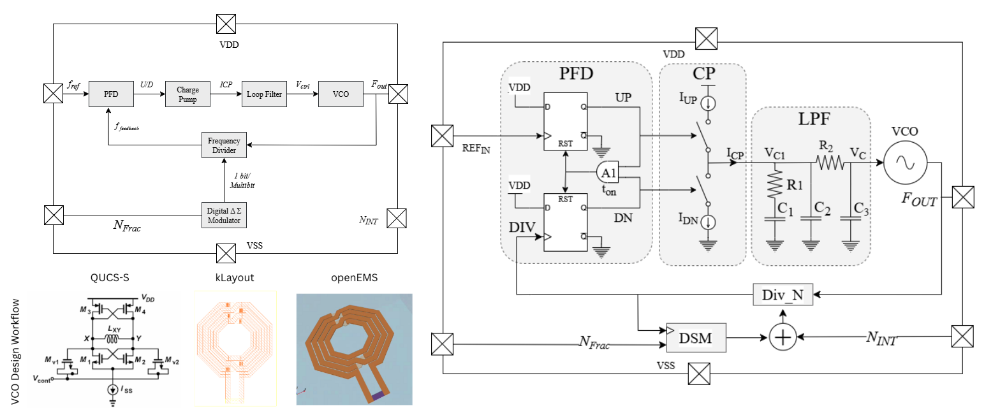
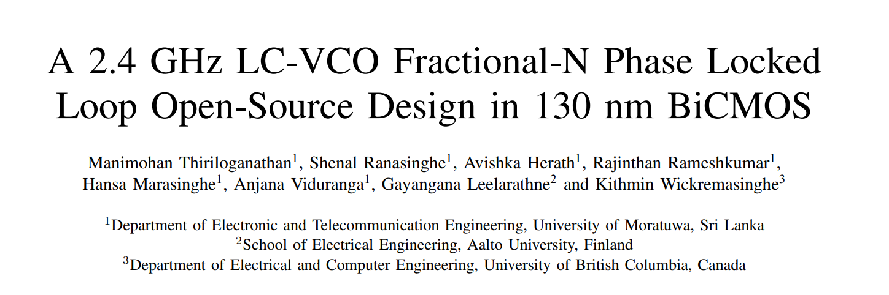

## A 2.4GHz Type-II ∆Σ Fractional-N Phase Locked Loop (PLL) with a Type IV Cross-Coupled Differential LC Voltage-Controlled Oscillator (VCO) for Wi-Fi/Bluetooth Applications - [Universalization of IC Design from CASS](https://github.com/unic-cass)

 *This design is currently under progress.

----------------------

## Table of Contents

1. [Introduction](docs/intro.md)
    - [Project Overview](#overview)
    - [Project Specifications](#specs)
    - [Project Application](#application)
2. [Behavioral Model](model/model.md)
    - [Design Calculations](model/calculations/calc.md)
    - [Python Model](model/model.md)
3. [RF Simulation Workflow](openems/openems.md)
    - [OpenEMS Simulation workflow](openems/openems.md)
    - [Inductor Design Simulations](openems/ind_sims.md)
        - [IHP SG13G2 PDK](openems/SG13G2/ind_sg13g2.md)
        - [SKY130 PDK](openems/SKY130/ind_sky130.md)
    - [Inductor Layout](openems/layout/ind_lay.md)
4. [PLL IP Blocks](schematic/design.md)
    - [Phase-Frequency Detector (PFD)](schematic/blocks/phase-freq-detector/pfd.md)
    - [Charge Pump (CP)](schematic/blocks/charge-pump/cp.md)
    - [Loop Filter](schematic/blocks/loop-filter/lf.md)
    - [Bias Generator](schematic/blocks/bias-generator/bia.md)
    - [Bandgap Reference](schematic/blocks/bandgap-ref/bgr.md)
    - [LC Voltage-Controlled Oscillator (LC-VCO)](schematic/blocks/lc-vco/vco.md)
    - [Delta-Sigma Modulator (DSM)](schematic/blocks/dsm/dsm.md)
    - [Frequency Divider (FD)](schematic/blocks/freq_divider/fd.md)
    - [TOP: Phase-Locked Loop (PLL)](schematic/blocks/top-pll/pll.md)
5. [Integrated PLL Design and TestBench](simulation/full_pll_design.md)
    - [Output Waveform of the LC-VCO](simulation/full_pll_design.md)
    - [Operation of the Charge Pump](simulation/full_pll_design.md)
    - [Operation of the DSM and FD](simulation/full_pll_design.md)
    - [Integrated PLL Simulation for N = 240](simulation/full_pll_design.md)
6. [PLL Layout Design](layout/layout_design.md)
    - [Phase-Frequency Detector Layout](layout/layout_design.md)
    - [Charge Pump Layout](layout/layout_design.md)
    - [Loop Filter Layout](layout/layout_design.md)
    - [Bias Generator Layout](layout/layout_design.md)
    - [Band gap Reference Layout](layout/layout_design.md)
    - [LC-VCO Layout](layout/layout_design.md)
    - [Delta-Sigma Modulator (DSM)](layout/layout_design.md)
    - [Frequency Divider Layout](layout/layout_design.md)
    - [TOP: Integrated PLL Layout](layout/layout_design.md)
7. [Important Information for TTSKY25b](docs/layout_info.md)
8. [Physical Verification (DRC, LVS)](post-layout/pv.md)
9. [Parasitic Extractions (RC) with Kpex](post-layout/kpex.md)
10. [Post-layout Simulations after PEX](post-layout/pex.md)
    - [Integrated PLL Simulation for N = 240](post-layout/pex.md)   
11. [TinyTapeout SKY25b Submission](docs/ttsky25b_mpw.md)
12. [Testing Plan with AD3](test/plan.md)
13. [Publication](#paper)
14. [Post-Layout Results](#results)
15. [References](#ref)

### Team Members (Department of Electronic and Telecommunication Engineering, University of Moratuwa)

- Rajinthan	Rameshkumar (UG).
- Anjana Viduranga (UG).
- Shenal Ranasinghe (UG).
- Manimohan	Thiriloganathan (BSc).
- Hansa Marasinghe (BSc).
- Avishka Herath (BSc).
- Gayangana Leelarathne (MSc) - School of Electrical Engineering, Aalto University, Finland.
- Kithmin Wickremasinghe (MASc) - Department of Electrical and Computer Engineering, University of British Columbia, Canada.
- Dr. Chamira Edussooriya (PhD).

Earlier contributors: Sajitha Madugalle, Lohan Atapattu.

### Overview of the Project:

The PLL is a charge-pump (CP) based (Type-II) PLL which uses a standard fractional-N architecture, where an output frequency divider (FD) is used to set the frequency multiplication with respect to the reference clock input; a 10 MHz crystal oscillator. In order to make the frequency of the VCO output signal equivalent to the frequency of a PFD reference input, the frequency divider (FD) divides the frequency by a fractional value using the delta sigma modulation (DSM) technique. The output frequency `f_out` is `N * f_ref`, where `N` is the division ratio of `XDIV_OUT` and `f_ref` is the input clock frequency. Documentation for the PLL subcells is included below.

### Block Diagram of the Project:

     
    <em>Figure 1: Block Diagram of the PLL Design</em>

### Specifications of the Project:

| Category | Specification | Min | Typ | Max | Unit | Comments |
|----------|---------------|-----|-----|-----|------|----------|
| Top-level | Supply voltage (Design Input) | 1.7 | 1.8 | 1.9 | V | - |
| Top-level | Temperature (Design Input) | 20 | - | 50 | C | - |
| Top-level | Reference frequency (Design Input) | - | 10 | - | MHz | - |
| Top-level | Output center frequency range | 2.4 | 2.45 | 2.48 | GHz | - |
| Top-level | Output frequency range | 2.35 | - | 2.55 | GHz | - |
| Top-level | Expected PLL lock time | - | 25 | 40 | µs | - |
| Loop/Control | Loop bandwidth | 80 | 150 | 300 | kHz | - |
| Loop/Control | Phase margin | 50 | 55 | 60 | ° | - |
| Dividers/Buffers | MMD division range | 240 | 245 | 248 | - | - |
| Charge Pump | CP current range | 50 | 150 | 300 | µA | - |
| VCO | Oscillation frequency | 2.35 | 2.45 | 2.55 | GHz | - |
| VCO | Tuning range | 8 | 9 | 10 | % | - |
| VCO | K VCO sensitivity | 50| 80 | 150 | MHz/V | - |
| VCO | Phase noise (@100 kHz offset) | - | -85 | - | dBc/Hz | - |
| VCO | Phase noise (@1 MHz offset) | - | -100 | - | dBc/Hz | - |
| Robustness/PVT | Process corners covered | - | TT/FF/SS/FS/SF | - | - | - |
| Robustness/PVT | Monte Carlo yield on key specs | 99 | - | - | % | - |
| Power/Area | Total DC power consumption | - | 12 | 25 | mW | - |
| Power/Area | Power down current consumption | - | 0.5 | 5 | µA | - |
| Power/Area | Die area | 0.48 | 0.8 | 1.2 | mm² | 1 mm x 0.8 mm |

[Return to top](#toc)

### Application of the Project:

The design targets the 2.4 GHz industrial, scientific and medical (ISM) band, making it
suitable for Bluetooth Low Energy (BLE) and 2.4 GHz Wi-Fi transceivers. BLE requires
stringent phase noise performance and fast settling (typically < 150 µs) to maintain
stable frequency hopping and reliable data transmission.

[Return to top](#toc)

### Publication:

This work has been accepted for presentation at the **International Conference on
Synthesis, Modeling, Analysis and Simulation Methods, and Applications to Circuit
Design (SMACD) 2026**.

> M. Thiriloganathan, S. Ranasinghe, A. Herath, R. Rameshkumar, H. Marasinghe,
> A. Viduranga, G. Leelarathne and K. Wickremasinghe,
> "**A 2.4 GHz LC-VCO Fractional-N Phase Locked Loop Open-Source Design in 130-nm BiCMOS**,"
> *SMACD*, 2026.

     
    <em>Figure 2: SMACD 2026 paper</em>

Manuscripts and figure sources are in [`paper_submission/`](paper_submission/).

**Key contribution.** RF integrated circuit design in the open-source CMOS ecosystem is
limited by the absence of reliable passive device models, particularly on-chip spiral
inductors. Consequently, prior open-source work relies on ring-oscillator-based VCOs with
degraded phase noise. This design uses a cross-coupled differential LC-VCO with a
**custom-designed on-chip spiral inductor**, developed using an open-source
electromagnetic modelling workflow in *OpenEMS*. To the best of our knowledge, this is the
first fully open-source CMOS PLL design with an integrated on-chip spiral inductor.

**Spiral inductor.** Three-turn symmetric octagonal geometry on *TopMetal2* with
*TopMetal1* underpasses through *TopVia2*; outer radius Rout = 218 µm, turn
spacing S = 14 µm, trace width W = 30 µm. Characterised in OpenEMS (FDTD, 0–12 GHz
Gaussian excitation, 0.5 µm refined cell size) with two-step open-short de-embedding:

| Quantity | Value |
|----------|-------|
| Differential inductance Ldiff @ 2.45 GHz | 4.000 nH |
| Differential quality factor Qdiff @ 2.45 GHz | 16.80 |
| Peak Qdiff | ≈ 18.9 near 3.8 GHz |
| Qdiff across 2.3–2.7 GHz (±5 % geometry) | 16.32 – 17.49 |
| Ldiff across 2.3–2.7 GHz (±5 % geometry) | 3.9 – 4.1 nH |

**Tools.** *Xschem* for schematic capture, *ngspice* for transient and noise simulation,
*KLayout* for layout and physical verification, *OpenEMS* for electromagnetic modelling —
a fully open-source EDA flow on the IHP SG13G2 open-source PDK.

[Return to top](#toc)

### Post-Layout Results:

The integrated PLL layout passed both DRC and LVS and was validated through post-layout
simulation with parasitic extraction.

| Metric | Value |
|--------|-------|
| Technology | IHP SG13G2, 130 nm SiGe BiCMOS |
| Output frequency range | 2.4 – 2.48 GHz |
| VCO tuning range | > 3.3 % |
| VCO sensitivity KVCO | ≈ 120 MHz/V |
| Phase noise @ 1 MHz offset | −100.8 dBc/Hz (carrier 2.44 GHz) |
| Reference spur | ≈ −40.2 dBc |
| Total power consumption | 12.73 mW |
| Die area | 930 µm × 666 µm (≈ 0.619 mm²) |

The tuning curve is nonlinear owing to varicap behaviour and layout-induced parasitics.
The reference spur is slightly high, though it still meets BLE specifications; further
improvement is needed.

**Comparison with PLL architectures operating near the 2.4 GHz band:**

| PLL Architecture | VCO | Process | Frequency (GHz) | Phase Noise (dBc/Hz) | Power (mW) | Area (mm²) |
|------------------|-----|---------|-----------------|----------------------|------------|------------|
| Integer-N PLL | Ring-Oscillator | 130 nm | 2.4 | -167.88 (@1MHz) | 11.63 | 0.0495 |
| Integer-N PLL | CMOS LC VCO | 180 nm | 2.4 | -119 (@1MHz) | 8 | 0.96 |
| CMOS LC-PLL | CMOS LC VCO | 65 nm | 10.3 | -95.12 (@1MHz) | 6.8 | — |
| Fractional-N PLL | Multi-Core VCO | 130 nm | 0.125–8.4 | -152.9 (@10MHz) | — | — |
| Fractional-N Oversampling PLL | CMOS LC VCO | 65 nm | 2.4 | -217.8 (FOM) | 4.97 | 0.58 |
| **Our Design [Fractional-N PLL]** | **CMOS LC VCO** | **130 nm** | **2.4** | **-100.8 (@1MHz)** | **12.73** | **0.619** |

**Future work.** Reference spur suppression via charge pump matching and loop filter
optimisation; higher-order ∆Σ modulators and fast-locking techniques to reduce fractional
spurs and settling time while maintaining stable PLL operation.

[Return to top](#toc)

### References:

The following open-source PLL designs were referred to during the development of this project:
- Our past IHP openMPW submission (30 MHz Fractional-N PLL) - [https://github.com/avishkaherath/TO_July2025](https://github.com/avishkaherath/TO_July2025/blob/main/30_MHz_Fractional_N_PLL/doc/source/designdata.rst)
- tt08-tiny-pll - [https://github.com/LegumeEmittingDiode/tt08-tiny-pll](https://github.com/LegumeEmittingDiode/tt08-tiny-pll)
- Razavi papers

Cited in the paper:
- N. F. Assaify *et al.*, "A ring-oscillator-based 2.4 GHz integer-N PLL design in skywater 130nm open-source technology," in *ISPACS*, 2025.
- B. Razavi, "Education of chip designers at a large scale: A proposal," *IEEE Solid-State Circuits Mag.*, 2024.
- K. Herman *et al.*, "On the versatility of the IHP BiCMOS open source and manufacturable PDK," *IEEE Solid-State Circuits Mag.*, vol. 16, no. 2, pp. 30–38, 2024.
- D. Liao *et al.*, "A 2.4-GHz 16-phase sub-sampling fractional-N PLL with robust soft loop switching," *IEEE J. Solid-State Circuits*, 2018.
- G. Z. Gomez *et al.*, "Bluetooth low energy (BLE) radio design trends and considerations," *Electronics*, 2021.
- B. Razavi, *RF Microelectronics*. Pearson, 2011.
- S. S. Mohan *et al.*, "Simple accurate expressions for planar spiral inductances," *IEEE J. Solid-State Circuits*, 1999.
- T. Liebig *et al.*, "openEMS—a free and open source equivalent-circuit (EC) FDTD simulation platform," *Int. J. Numer. Model.*, 2013.
- F. Zhang *et al.*, "Design optimization and modeling of on-chip RF inductors in CMOS," in *IEEE MWSCAS*, 2009.
- D. Ham and A. Hajimiri, "Concepts and methods in optimization of integrated LC VCOs," *IEEE J. Solid-State Circuits*, 2001.
- J. Jo *et al.*, "Low phase-noise, 2.4 and 5.8 GHz dual-band frequency synthesizer with Class-C VCO and bias-controlled charge pump," *Electronics*, 2022.
- J. S. Gaggatur *et al.*, "A digitally programmable 9.1–11.2 GHz CMOS LC-PLL with integrated power management for X-Band FMCW radar systems," in *IEEE SPACE*, 2025.
- H. Shi *et al.*, "An ultra-wideband 125-MHz-to-8.4-GHz fractional-N PLL featuring an isolated multi-core VCO and an active-feedback doubler," *IEEE Microw. Wireless Technol. Lett.*, 2026.
- J. Qiu *et al.*, "A 32-kHz-reference 2.4-GHz Fractional-N oversampling PLL with 200-kHz loop bandwidth," *IEEE J. Solid-State Circuits*, 2021.

[Return to top](#toc)