## A 2.4 GHz Type-II ∆Σ Fractional-N Phase Locked Loop (PLL) with a Type-IV Cross-Coupled Differential LC Voltage-Controlled Oscillator (VCO) for Wi-Fi/Bluetooth Applications — [Universalization of IC Design from CASS](https://github.com/unic-cass)

<a name="toc"></a>
# Table of Contents

1. [Members](#members)
2. [Overview of the Project](#overview)
3. [Specifications of the Project](#specs)
    - [Achieved — as published at SMACD 2026](#specs_achieved)
    - [Specifications not yet verified](#specs_open)
4. [Circuit Design](#circuit)
    - [Phase-Locked Loop (PLL)](#pll)
    - [Phase-Frequency Detector (PFD)](#pfd)
    - [Charge Pump (CP)](#cp)
    - [Loop Filter (LF)](#lf)
    - [Bandgap Reference (BGR)](#bgr)
    - [LC Voltage-Controlled Oscillator (LC-VCO)](#vco)
    - [Delta-Sigma Modulator and Fractional-N Divider](#dsm)
5. [On-Chip Spiral Inductor](#inductor)
    - [Geometry and Performance](#ind_geom)
    - [Open-Source EM Extraction Flow](#ind_flow)
6. [Simulation Results (Pre-Layout)](#sim)
    - [LC-VCO Output Waveform and Spectrum](#sim_vco)
    - [Varactor Tuning Range](#sim_var)
    - [VCO Tuning Curve and K_VCO](#sim_kvco)
    - [Integrated PLL Testbench](#sim_pll)
    - [Integrated Pre-Layout Simulation Circuit](#sim_circuit)
7. [Layout Design](#layout)
    - [Integrated PLL Layout](#lay_pll)
    - [3D View](#lay_3d)
    - [Layout Information](#layout_info)
8. [Physical Verification (DRC, LVS)](#pv)
9. [Post-Layout Results after PEX](#pex)
    - [Parasitic Extraction (RC) with Kpex](#pex_flow)
    - [Post-Layout Performance](#pex_results)
    - [Lock Behaviour](#pex_lock)
    - [Phase Noise](#pex_pn)
    - [Reference Spur](#pex_spur)
    - [Comparison with Published Work](#pex_cmp)
10. [UNIC-CASS Mock Tapeout](#tapeout)
11. [Repository Structure](#repo)
12. [Publication](#paper)
13. [References](#ref)

---

<a name="members"></a>
## 1. Members (Department of Electronic and Telecommunication Engineering, University of Moratuwa)

- Manimohan	Thiriloganathan (BSc).
- Shenal Ranasinghe (UG).
- Avishka Herath (BSc).
- Rajinthan	Rameshkumar (UG).
- Hansa Marasinghe (BSc).
- Anjana Viduranga (UG).
- Gayangana Leelarathne (MSc) - School of Electrical Engineering, Aalto University, Finland.
- Kithmin Wickremasinghe (MASc) - Department of Electrical and Computer Engineering, University of British Columbia, Canada.
- Dr. Chamira Edussooriya (PhD).

Earlier contributors: Sajitha Madugalle, Lohan Atapattu.

[Return to top](#toc)

---

<a name="overview"></a>
## 2. Overview of the Project

This project implements a charge-pump (Type-II) **fractional-N phase-locked loop** in the
**IHP SG13G2 130 nm open-source BiCMOS PDK**, using a fully open-source EDA flow. The
loop synthesises the 2.4 GHz ISM band from a stable `10 MHz` reference.

### Architecture

- **Phase-frequency detector** compares the reference `CLK_IN` against the divided VCO
  output and emits `UP`/`DN` pulses proportional to phase error.
- **Charge pump** converts those pulses into a signed current into the loop filter.
- **Third-order passive loop filter** integrates that charge into the control voltage
  `VCTRL` and suppresses reference-rate ripple.
- **Cross-coupled LC-VCO** converts `VCTRL` into an output near 2.44 GHz, tuned by an
  accumulation-mode varactor pair across a tank built on a **custom on-chip spiral
  inductor**.
- **Fractional-N divider** divides the output by 240 or 248, dithered by a first-order
  **delta-sigma modulator** so the *average* ratio is fractional.

### Frequency Relationship

`f_out = N_eff × f_ref`, where `N_eff` ranges from 240 to 248 as set by a 9-bit word
loaded serially over `SCLK`/`SDATA`/`EN`. With `f_ref = 10 MHz` this spans
`2.40 GHz to 2.48 GHz`, covering the 2.4 GHz ISM band. Fractional-N is what gets the
channel resolution below the 10 MHz reference spacing that integer-N would impose.

### Why this design is unusual

Open-source PDKs ship **no on-chip spiral inductor models**. Every previously published
open-source PLL therefore falls back on a ring oscillator and accepts the phase-noise
penalty. This design builds the missing model from scratch with an electromagnetic
solver, making it — to the best of our knowledge — the **first fully open-source CMOS
PLL with an integrated on-chip spiral inductor**.

### Block Diagram

<center></center>
<p align="center"><em>Figure 1: Block diagram of the fractional-N PLL</em></p>

[Return to top](#toc)

---

<a name="specs"></a>
## 3. Specifications of the Project

The goal was a 2.4 GHz fractional-N synthesiser suitable for BLE and 2.4 GHz Wi-Fi,
minimising power and area while meeting phase-noise and settling requirements. BLE needs
stringent phase noise and fast settling (typically `< 150 µs`) for stable frequency
hopping.

| Category | Specification | Min | Typ | Max | Unit |
|----------|---------------|-----|-----|-----|------|
| Top-level | Supply voltage | 1.08 | **1.20** | 1.32 | V |
| Top-level | Temperature | 20 | 27 | 50 | °C |
| Top-level | Reference frequency | – | 10 | – | MHz |
| Top-level | Output centre frequency range | 2.40 | 2.45 | 2.48 | GHz |
| Top-level | Expected PLL lock time | – | 25 | 40 | µs |
| Loop/Control | Loop bandwidth | 80 | 150 | 300 | kHz |
| Loop/Control | Phase margin | 50 | 55 | 60 | ° |
| Dividers | MMD division range | 240 | 245 | 248 | – |
| Charge Pump | CP current range | 50 | 150 | 300 | µA |
| VCO | Oscillation frequency | 2.35 | 2.45 | 2.55 | GHz |
| VCO | K<sub>VCO</sub> sensitivity | 50 | 80 | 150 | MHz/V |
| VCO | Phase noise (@1 MHz offset) | – | −100 | – | dBc/Hz |
| Power/Area | Total DC power consumption | – | 12 | 25 | mW |
| Power/Area | Die area | 0.48 | 0.8 | 1.2 | mm² |

> **Supply note.** Earlier revisions of this repository listed a 1.8 V supply. That was
> inherited from an older plan and is wrong for this implementation: SG13G2 low-voltage
> devices are 1.2 V parts, every testbench runs at `.param VDD=1.2`, and the archived
> corner runs use 1.08 / 1.20 / 1.32 V.

<a name="specs_achieved"></a>
### 3.1 Achieved — post-layout, as published at SMACD 2026

Values below are the ones reported in the paper (see [§12](#paper)), measured from
post-layout simulation with parasitic extraction at V<sub>DD</sub> = 1.2 V, 27 °C,
f<sub>REF</sub> = 10 MHz, carrier 2.44 GHz.

| Parameter | Target | **Achieved** | Verdict |
|-----------|--------|--------------|---------|
| Technology | – | IHP SG13G2, 130 nm SiGe BiCMOS | – |
| Architecture | – | Type-II fractional-N, 1st-order digital ∆Σ | – |
| Reference frequency | 10 MHz | 10 MHz | ✅ |
| Division ratios | 240 … 248 | 240 and 248, ∆Σ-dithered | ✅ |
| Output frequency range | 2.40 – 2.48 GHz | **2.4 – 2.48 GHz** | ✅ meets |
| VCO tuning range | 8 – 10 % | **> 3.3 %** | ⚠️ below target, covers the ISM band |
| K<sub>VCO</sub> | 50 – 150 MHz/V | **≈ 120 MHz/V** | ✅ in range |
| Phase noise @ 1 MHz offset | −100 dBc/Hz | **−100.8 dBc/Hz** | ✅ meets |
| Reference spur | better than −60 dBc | **≈ −40.2 dBc** | ⚠️ misses target, still meets BLE |
| Total DC power | 12 mW typ, 25 mW max | **12.73 mW** | ✅ meets |
| Die area | 0.48 – 1.2 mm² | **930 µm × 666 µm ≈ 0.619 mm²** | ✅ meets |
| Varactor capacitance swing | – | 70 – 200 fF over 1.2 V V<sub>CTRL</sub> | – |
| VCO startup | – | reliable down to ≈ 0.7 V tail bias | – |

**Spiral inductor (paper §II):**

| Parameter | Value |
|-----------|-------|
| Geometry | 3-turn symmetric octagonal, TopMetal2 spiral, TopMetal1 underpass via TopVia2 |
| R<sub>out</sub> / S / W | 218 µm / 14 µm / 30 µm |
| L<sub>diff</sub> @ 2.45 GHz | **4.000 nH** (2 % tolerance constraint) |
| Q<sub>diff</sub> @ 2.45 GHz | **16.80** |
| Peak Q<sub>diff</sub> | ≈ 18.9 near 3.8 GHz |
| Self-resonant frequency | ≈ 10 GHz |
| Q<sub>diff</sub> over 2.3 – 2.7 GHz, ±5 % geometry | 16.32 – 17.49 |
| L<sub>diff</sub> over 2.3 – 2.7 GHz, ±5 % geometry | 3.9 – 4.1 nH |
| EM setup | OpenEMS FDTD, 0 – 12 GHz Gaussian excitation, 0.5 µm refined cell size |

<a name="specs_open"></a>
### 3.2 Specifications not yet verified

Listed rather than silently omitted — these appear in the target table but have no
archived evidence in this repository:

| Specification | Status |
|---------------|--------|
| Lock time (25 – 40 µs) | Transient plots exist; no extracted signed-off number |
| Loop bandwidth and phase margin | Design values from `model/calculations/PLL/`; no post-layout loop-gain measurement |
| PVT across TT/FF/SS/FS/SF | Corner libraries wired into the testbenches; only the typical corner archived |
| Monte Carlo yield (99 %) | Not run |
| Power-down current | No power-down mode in this revision |

[Return to top](#toc)

---

<a name="circuit"></a>
## 4. Circuit Design

<a name="pll"></a>
### 4.1 Phase-Locked Loop (PLL)

The top-level cell `LC_VCO_FPLL` has the interface:

```
.subckt LC_VCO_FPLL CLK_IN VDD CLK_OUT VSS EN RST SDATA SCLK
```

| Pin | Direction | Function |
|-----|-----------|----------|
| `CLK_IN` | input | 10 MHz reference clock |
| `CLK_OUT` | output | Buffered 2.4 GHz VCO output |
| `EN`, `SCLK`, `SDATA` | input | Serial configuration of the division ratio |
| `RST` | input | Asynchronous active-high reset |
| `VDD`, `VSS` | supply | 1.2 V / ground |

A bandgap reference biases both the charge pump and the VCO tail current source, so loop
gain and oscillation amplitude track together over supply and temperature. Forty MIM
capacitors (20 µm × 20 µm) decouple the supply at the top level, keeping the switching
digital divider out of the VCO tank.

<a name="pfd"></a>
### 4.2 Phase-Frequency Detector (PFD)

Two rising-edge-triggered D flip-flops with a NAND reset — built entirely from SG13G2
standard cells:

| Instance | Cell | Role |
|----------|------|------|
| `x1` | `sg13g2_dfrbp_2` | Reference-path flip-flop, sets `UP` |
| `x2` | `sg13g2_dfrbp_2` | Feedback-path flip-flop, sets `DN` |
| `x3` | `sg13g2_nand2_2` | Reset from `UP · DN` |

Being a PFD rather than a plain phase detector, its average output tracks *frequency*
error as well as phase, so the loop pulls in without a separate acquisition aid. The
delay through the NAND reset path sets a minimum `UP`/`DN` pulse width, which removes the
**dead zone** that would otherwise leave the VCO drifting near zero phase error.

<a name="cp"></a>
### 4.3 Charge Pump (CP)

A current-steering charge pump: cascoded PMOS source and NMOS sink branches, switched by
`UP` and `DN`, biased from `VBGR`.

| Device | Type | W / L | Fingers | Role |
|--------|------|-------|---------|------|
| `MM9` | `sg13_lv_pmos` | 163.6 µm / 2 µm | 20 | Source device into `VCP` |
| `MM5` | `sg13_lv_nmos` | 40.7 µm / 2 µm | 5 | Sink device from `VCP` |
| `MM7` | `sg13_lv_pmos` | 29.6 µm / 2 µm | 5 | `UP` switch |
| `MM1` | `sg13_lv_nmos` | 6 µm / 2 µm | 1 | `DN` switch |
| `MM6` | `sg13_lv_nmos` | 3.9 µm / 2 µm | 1 | `VBGR` reference current |

Every device is drawn at `L = 2 µm` — not for speed, but for output impedance and
matching. **Up/down current mismatch is the dominant reference-spur mechanism**: any
imbalance injects a net charge packet once per reference cycle, modulating the VCO at
10 MHz.

<a name="lf"></a>
### 4.4 Loop Filter (LF)

Third-order passive, entirely on-chip:

| Element | Device | Size | Value |
|---------|--------|------|-------|
| `RR1`, `RR2` | `rppd` | W = 2 µm, L = 407.2 µm | ≈ 14.84 kΩ each |
| `CC1` | `cap_cmim` | 48.34 µm × 48.34 µm, m = 16 | Integrating capacitor |
| `CC2` | `cap_cmim` | 18.63 µm × 18.63 µm, m = 4 | Ripple bypass |

`C1` gives the pole at the origin that makes the loop **type-II** (zero static phase
error). `R1` sets the stabilising zero that recovers phase margin. `R2`–`C2` add a third
pole well above the loop bandwidth to attenuate reference-rate ripple without eating the
margin `R1` just bought back.

<a name="bgr"></a>
### 4.5 Bandgap Reference (BGR)

An all-CMOS self-biased reference producing `VBGR ≈ 0.6 V`, with a startup network
(`dn2`/`dn3`/`dn4`) that forces the circuit out of its zero-current state at power-up and
then disengages. Channel lengths of 5 µm and above throughout — matching and low flicker
noise matter far more than speed here, because `VBGR` noise reaches the VCO tail and
up-converts into phase noise.

<a name="vco"></a>
### 4.6 LC Voltage-Controlled Oscillator (LC-VCO)

A **type-IV cross-coupled topology**: complementary NMOS *and* PMOS cross-coupled pairs
across a shared LC tank, with an NMOS tail current source.

<center>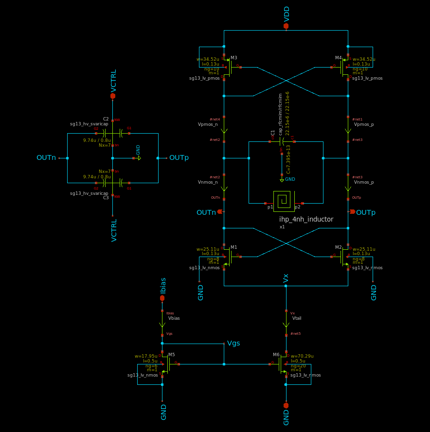</center>
<p align="center"><em>Figure 2: LC-VCO schematic</em></p>

| Device | Type | W / L | Fingers | Role |
|--------|------|-------|---------|------|
| `MM1`, `MM2` | `sg13_lv_nmos` | 21.99 µm / 130 nm | 3 | NMOS cross-coupled pair |
| `MM3`, `MM4` | `sg13_lv_pmos` | 36 µm / 130 nm | 5 | PMOS cross-coupled pair |
| `MM5` | `sg13_lv_nmos` | 384 µm / 1 µm | 48 | Tail current source |
| `MM6` | `sg13_lv_nmos` | 64 µm / 1 µm | 8 | Tail mirror diode |
| `MM7` | `sg13_lv_pmos` | 38 µm / 1 µm | 5 | Bias injection from `VBGR` |
| `MM8`, `MM9` | lv pmos / nmos | 15 µm, 1.5 µm / 130 nm | 10 / 1 | Output buffer |
| `MM10`, `MM11` | lv pmos / nmos | 15 µm, 1.5 µm / 130 nm | 10 / 1 | Dummy, balances the load |

Adding the PMOS pair roughly doubles the transconductance available for a given bias
current, which buys startup margin — the design starts reliably down to about `0.7 V` on
the tail bias — at the cost of extra tank parasitic capacitance.

`MM10`/`MM11` drive nothing. They exist so both tank nodes see the same capacitive load;
an asymmetric load would convert common-mode noise into phase noise.

**The tank:**

| Element | Device | Size | Value |
|---------|--------|------|-------|
| `x1` | `4nH_INDUCTOR` | see [§5](#inductor) | 4.0 nH, Q<sub>diff</sub> = 16.8 @ 2.45 GHz |
| `CC1` | `rfcmim` | 21.9 µm × 21.9 µm | Fixed tank capacitance |
| `CC2`, `CC3` | `sg13_hv_svaricap` | 9.74 µm / 0.8 µm, Nx = 7 | Tuning, 70–200 fF over 1.2 V |

<a name="dsm"></a>
### 4.7 Delta-Sigma Modulator and Fractional-N Divider

The only synthesised block, hardened from Verilog with Yosys and LibreLane into the
`DSM_N_FREQ_DIV` macro.

**Divider chain:**

```
CLK_OUT ──► ÷4 fixed ──► ÷4/÷5 prescaler ──► mod-7 counter ──► ÷2 duty corrector ──► CLK_FB
 2.4 GHz      600 MHz          ▲                     │
                               └─── modulus controller ◄─── SEL (from ΔΣ)
```

| Path | Arithmetic | Total |
|------|-----------|-------|
| ÷4 → (÷4/÷5 + mod-7 = 30) → ÷2 | 4 × 30 × 2 | **240** |
| ÷4 → (÷4/÷5 + mod-7 = 31) → ÷2 | 4 × 31 × 2 | **248** |

Only the first stage runs at 2.4 GHz; everything after it sees 600 MHz or less, so the
ratio-switching logic is ordinary synthesised standard-cell logic. The final ÷2 forces an
exact 50 % duty cycle, so the PFD sees no ratio-dependent phase offset.

**Delta-sigma modulator:** a first-order digital modulator — 9-bit signed accumulator,
9-bit comparator acting as a 1-bit quantiser, and a mapper expanding the decision back to
9 bits for subtraction. It shapes the quantisation error to high frequencies where the
loop filter attenuates it, replacing discrete fractional spurs with a small noise floor.
This is why the loop bandwidth must stay well below the frequency at which the shaped
noise rises.

[Return to top](#toc)

---

<a name="inductor"></a>
## 5. On-Chip Spiral Inductor

<a name="ind_geom"></a>
### 5.1 Geometry and Performance

<center>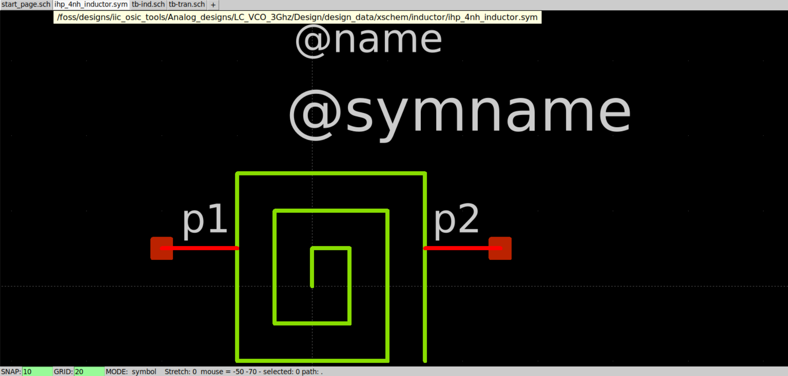</center>
<p align="center"><em>Figure 3: Inductor symbol used in the VCO schematic</em></p>

| Parameter | Symbol | Value |
|-----------|--------|-------|
| Turns | N | 3 |
| Shape | – | Symmetric octagonal |
| Outer radius | R<sub>out</sub> | 218 µm |
| Turn spacing | S | 14 µm |
| Trace width | W | 30 µm |
| Main spiral | – | TopMetal2 (3.0 µm thick, σ = 3.03e7 S/m) |
| Underpass | – | TopMetal1 via TopVia2 |

**Octagonal** rather than square: the 45° corners avoid the current crowding that square
corners cause. **TopMetal2** because it is the thickest metal in the stack, giving the
lowest series resistance — and series resistance is what limits Q.

| Quantity | Value |
|----------|-------|
| L<sub>diff</sub> @ 2.45 GHz | 4.000 nH |
| Q<sub>diff</sub> @ 2.45 GHz | 16.80 |
| Peak Q<sub>diff</sub> | ≈ 18.9 near 3.85 GHz |
| Self-resonant frequency | ≈ 9.95 GHz |
| Q<sub>diff</sub> over 2.3–2.7 GHz (±5 % geometry) | 16.32 – 17.49 |
| L<sub>diff</sub> over 2.3–2.7 GHz (±5 % geometry) | 3.9 – 4.1 nH |

<center>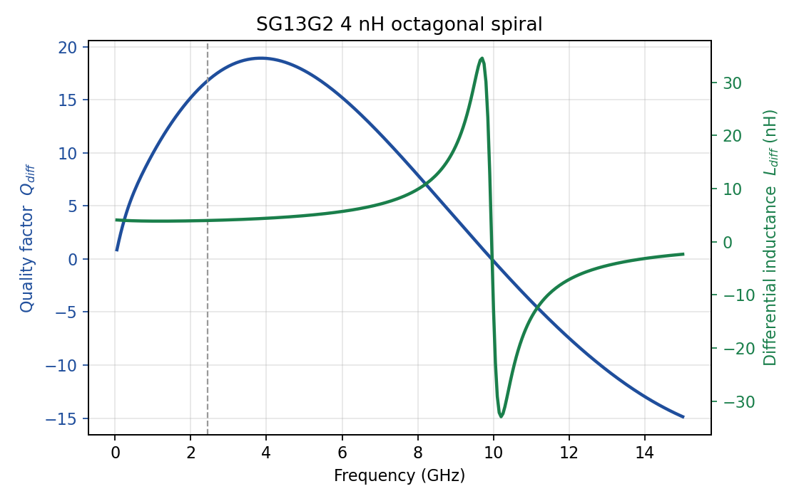</center>
<p align="center"><em>Figure 4: Differential inductance and quality factor versus frequency, produced by the open-source flow in <code>em/</code></em></p>

Tank Q is essentially inductor Q, and oscillator phase noise falls as 1/Q², so every
point of Q is worth roughly 2 dB. Maximising Q<sub>diff</sub> at 2.45 GHz was therefore
the objective of the geometry optimisation; the 4 nH target was the *constraint*.

<a name="ind_flow"></a>
### 5.2 Open-Source EM Extraction Flow

The taped-out model was produced with Ansys HFSS (archived in
[`archive/hfss/`](archive/hfss/)). It has since been **reproduced by a fully open-source
flow** in [`em/`](em/), which takes the layout and emits the SPICE model directly:

```
gds/blocks/4nH_INDUCTOR.gds
      │  flatten polygons, map GDS layers onto the SG13G2 stackup
      ▼
 OpenEMS FDTD (0–12 GHz, graded mesh, real BEOL stack and substrate)
      │  raw 2-port S-parameters
      ▼
 two-step open-short de-embedding
      │
      ├──► L_diff, Q_diff, peak Q, SRF + plot
      ▼
 vector fit (shared poles) ──► .subckt 4nH_INDUCTOR 1 2
```

The generated model has the **same subcircuit name and pin order** as the HFSS export, so
it drops straight into the Xschem testbenches with no schematic change.

Running the flow against the archived reference reproduces every published figure:

| Quantity | Open-source flow | HFSS / paper |
|----------|------------------|--------------|
| L<sub>diff</sub> @ 2.45 GHz | 4.0005 nH | 4.000 nH |
| Q<sub>diff</sub> @ 2.45 GHz | 16.805 | 16.80 |
| Peak Q<sub>diff</sub> | 18.915 at 3.85 GHz | ≈ 18.9 near 3.8 GHz |
| Self-resonant frequency | 9.95 GHz | ≈ 10 GHz |

```bash
cd em
pip install -r requirements.txt
python scripts/validate.py                                   # self-check
python scripts/run_pipeline.py --config config/inductor_4nH.yaml
```

Full details in [`em/README.md`](em/README.md).

[Return to top](#toc)

---

<a name="sim"></a>
## 6. Simulation Results (Pre-Layout)

<a name="sim_vco"></a>
### 6.1 LC-VCO Output Waveform and Spectrum

<center>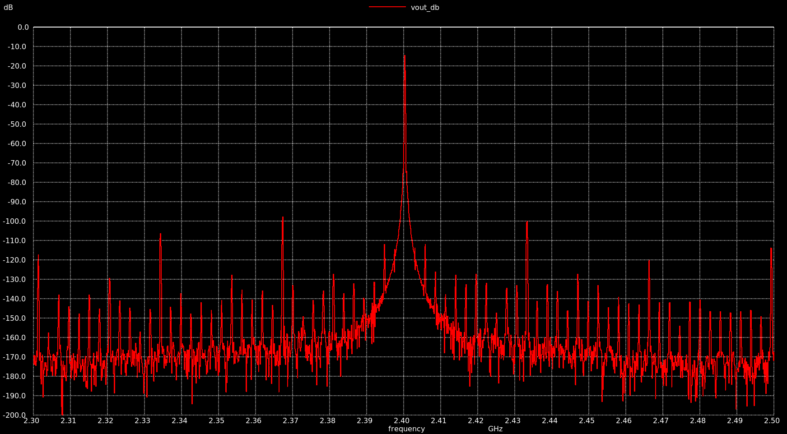</center>
<p align="center"><em>Figure 5: LC-VCO output spectrum at 2.4 GHz</em></p>

<a name="sim_var"></a>
### 6.2 Varactor Tuning Range

<center>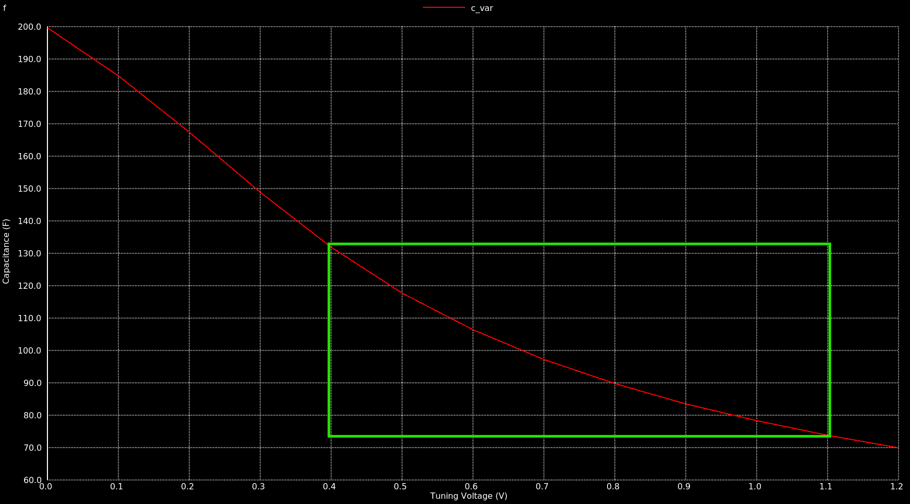</center>
<p align="center"><em>Figure 6: Varactor capacitance versus control voltage — 70 fF to 200 fF over 1.2 V</em></p>

<a name="sim_kvco"></a>
### 6.3 VCO Tuning Curve and K<sub>VCO</sub>

<center>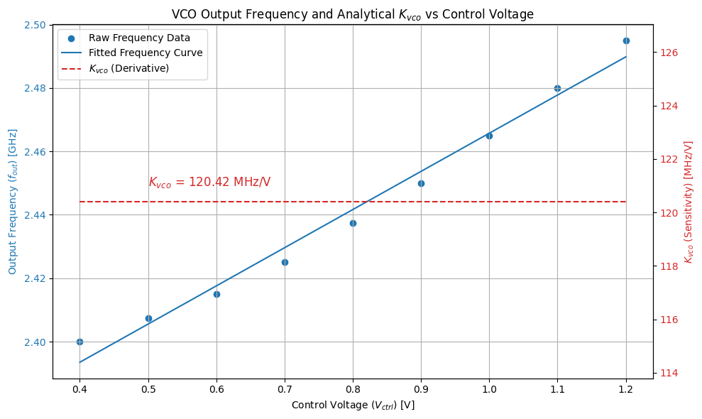</center>
<p align="center"><em>Figure 7: Oscillation frequency and K<sub>VCO</sub> versus control voltage</em></p>

<a name="sim_pll"></a>
### 6.4 Integrated PLL Testbench

<center>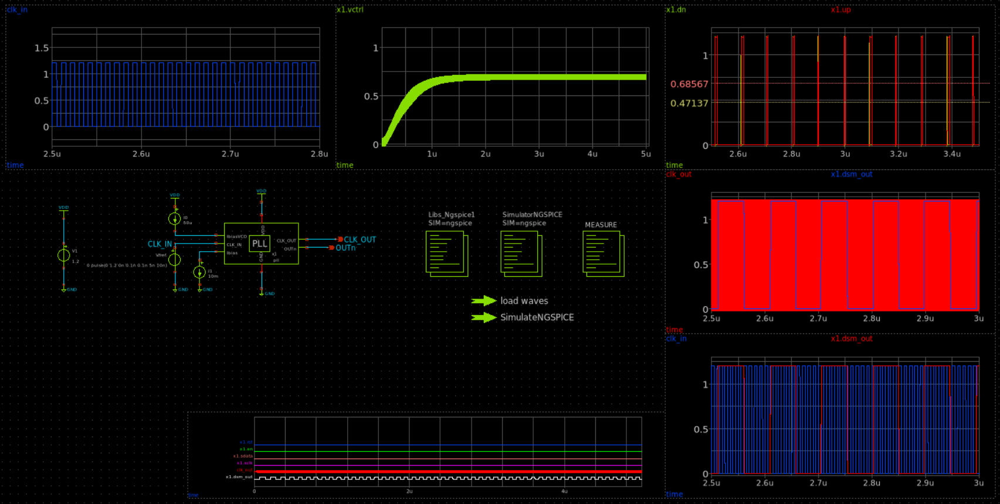</center>
<p align="center"><em>Figure 8: Closed-loop PLL testbench</em></p>

<a name="sim_circuit"></a>
### 6.5 Integrated Pre-Layout Simulation Circuit

The complete schematic driven for the pre-layout closed-loop runs — PFD, charge pump,
loop filter, LC-VCO, bandgap reference and the ∆Σ fractional-N divider wired as one
system.

<center></center>
<p align="center"><em>Figure 9: Integrated pre-layout simulation circuit</em></p>

[Return to top](#toc)

---

<a name="layout"></a>
## 7. Layout Design

<a name="lay_pll"></a>
### 7.1 Integrated PLL Layout

<center></center>
<p align="center"><em>Figure 10: Top-level PLL layout — 930 µm × 666 µm</em></p>

<center>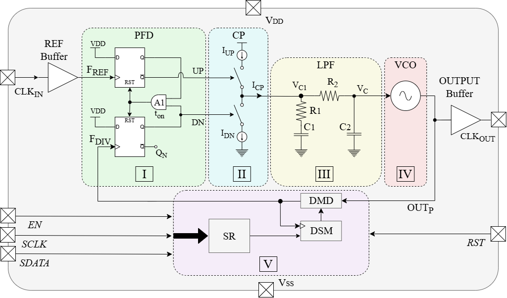</center>
<p align="center"><em>Figure 11: Annotated view of the same layout, with the five blocks marked</em></p>

The spiral inductor dominates the die and sets its size. The floorplan reflects each
block's sensitivity: the inductor and VCO occupy a guard-ringed region as far as
practical from the digital divider; the switching `DSM_N_FREQ_DIV` macro is placed away
from the tank with its own decoupling; and the PFD, charge pump and loop filter sit
together as the `PFD_CP_LF` group, because charge-pump current matching depends on how
the filter loads it.

<a name="lay_3d"></a>
### 7.2 3D View

The metal stack rendered in three dimensions — the spiral on TopMetal2 with its
TopMetal1 underpass is clearly separated from the rest of the circuitry below.

<center></center>
<p align="center"><em>Figure 12: 3D view of the integrated PLL layout</em></p>

<a name="layout_info"></a>
### 7.3 Layout Information

| | **Width (µm)** | **Height (µm)** | **Area (µm²)** | Notes |
|--|---------------|-----------------|----------------|-------|
| **Integrated PLL** | 930 | 666 | 619,380 (≈ 0.619 mm²) | all layers |
| **Spiral inductor** | 666 | 672 | ≈ 447,000 | TopMetal2 / TopMetal1, guard-ringed |

[Return to top](#toc)

---

<a name="pv"></a>
## 8. Physical Verification (DRC, LVS)

All runs used **KLayout 0.30.11** against the IHP SG13G2 rule decks (`main` and
`sg13g2_maximal` tables for DRC).

| Cell | DRC | LVS |
|------|-----|-----|
| `LC_VCO_FPLL` (integrated top level) | ✅ clean | ✅ match |
| `PFD_CP_LF` | ✅ clean | ✅ match |
| `PHASE_FREQ_DET` | ✅ clean | ✅ match |
| `CHARGE_PUMP` | ✅ clean | ✅ match |
| `LOOP_FILTER` | ✅ clean | ✅ match |
| `BANDGAP_REF` | ✅ clean | ✅ match |
| `DSM_N_FREQ_DIV` | ✅ clean | ✅ match |
| `LC_VCO_NOIND` | ✅ clean | ✅ match |
| `LC_VCO` | ✅ clean | ⚠️ port labels — see note |
| `4nH_INDUCTOR` | ✅ clean | ℹ️ extraction only |

**The integrated top level `LC_VCO_FPLL` is DRC clean and LVS matching** — the result
that gates tapeout.

> **Note on the standalone `LC_VCO`.** Its LVS run reports five **top-level port label**
> mismatches and no device or net mismatches — the internal connectivity is correct. The
> same cell passes as instantiated inside `LC_VCO_FPLL`, where those nets are ordinary
> internal nets. It does mean `gds/blocks/LC_VCO.gds` cannot be reused as a standalone
> macro until the pin labels are added. `4nH_INDUCTOR` is extraction-only because there
> is no schematic to compare a passive spiral against; LVS sees the two-terminal black
> box `spice/4nH_INDUCTOR_LVS.spice`.

<center></center>
<p align="center"><em>Figure 13: DRC and LVS run logs for the blocks</em></p>

Archived runs live in [`drc/`](drc/) and [`lvs/`](lvs/), one directory per cell.

[Return to top](#toc)

---

<a name="pex"></a>
## 9. Post-Layout Results after PEX

Nominal conditions: V<sub>DD</sub> = 1.2 V, 27 °C, typical corner, f<sub>REF</sub> =
10 MHz, carrier 2.44 GHz.

<a name="pex_flow"></a>
### 9.1 Parasitic Extraction (RC) with Kpex

RC extraction is run with Magic through `kpex`. Results are archived per cell in
[`pex/`](pex/):

```
pex/<CELL>__<TOPCELL>/
  kpex.log
  magic_RC/<CELL>.pex.spice              ← the extracted netlist used in PEX simulation
  magic_RC/<CELL>.ext
  magic_RC/<CELL>_MAGIC_RC_Script.tcl
```

Extracted netlists feed the `*_PEX` testbenches in [`simulations/`](simulations/), for
example `tb_CP_LF_PEX.spice` and `tb_PHASE_FREQ_DET_PEX.spice`. PEX is archived for
`BANDGAP_REF`, `CHARGE_PUMP_V1`, `DSM_N_FREQ_DIV`, `LOOP_FILTER` and `PHASE_FREQ_DET`.

> ⚠️ The archived charge-pump extraction is for revision **V1**, while **V2** is the
> layout that ships in the top level. PEX simulation of that block does not currently
> reflect the shipping layout and should be re-extracted.

<a name="pex_results"></a>
### 9.2 Post-Layout Performance

| Metric | Value |
|--------|-------|
| Output frequency range | 2.40 – 2.48 GHz |
| VCO tuning range | > 3.3 % |
| K<sub>VCO</sub> | ≈ 120 MHz/V |
| Phase noise @ 1 MHz offset | **−100.8 dBc/Hz** |
| Reference spur | ≈ −40.2 dBc |
| Total power consumption | **12.73 mW** |
| Die area | **930 µm × 666 µm (≈ 0.619 mm²)** |

<a name="pex_lock"></a>
### 9.3 Lock Behaviour

<center>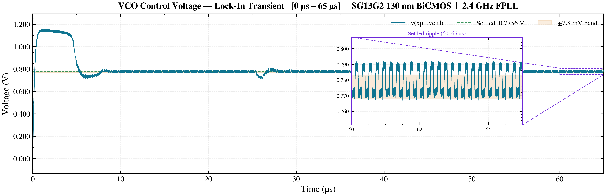</center>
<p align="center"><em>Figure 14: Control voltage during acquisition — settles without sustained ringing</em></p>

<a name="pex_pn"></a>
### 9.4 Phase Noise

<center>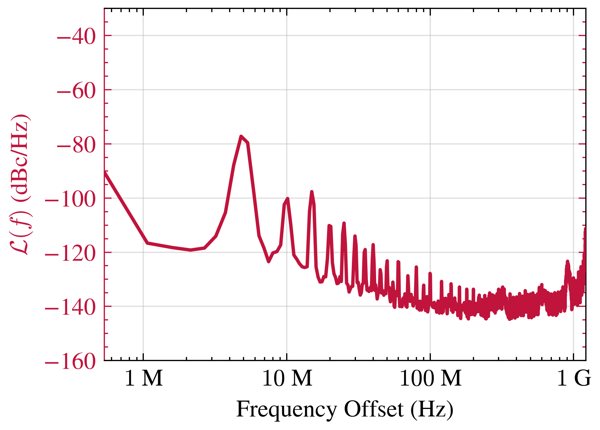</center>
<p align="center"><em>Figure 15: Closed-loop phase noise at a 2.44 GHz carrier — −100.8 dBc/Hz at 1 MHz offset</em></p>

> ngspice has no closed-loop PLL phase-noise analysis, so phase noise is derived by
> post-processing a long transient. The spectrum is taken from the **settled** portion
> only — including the acquisition transient corrupts it. The reference open-source work
> this is compared against uses the same method, so the comparison is like-for-like.

<a name="pex_spur"></a>
### 9.5 Reference Spur

<center>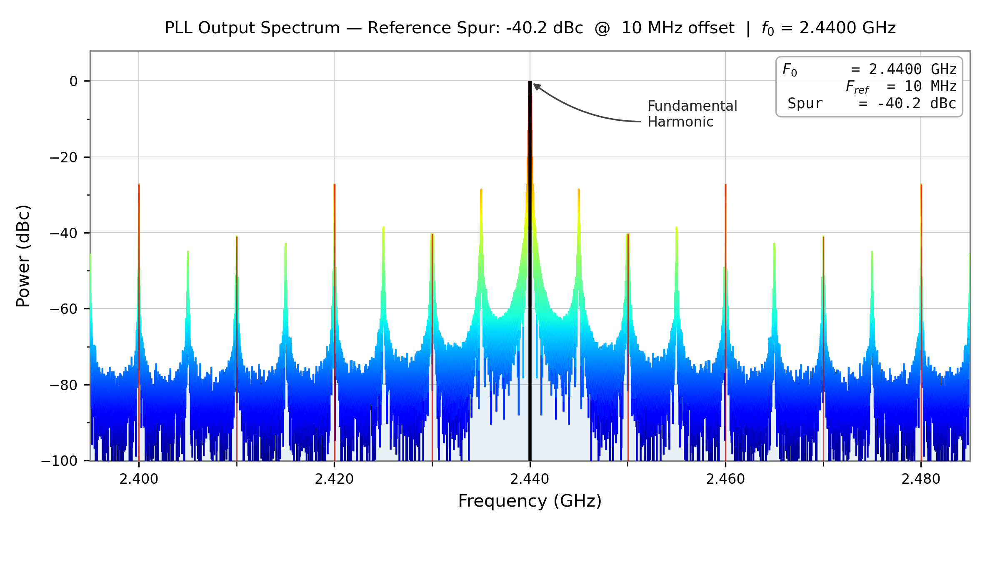</center>
<p align="center"><em>Figure 16: Output spectrum showing the reference spur at f<sub>out</sub> ± 10 MHz</em></p>

At ≈ −40.2 dBc this is the weakest result in the design. It clears BLE requirements but
misses the −60 dBc target. The two mechanisms are charge-pump up/down current mismatch
and finite loop-filter rejection at 10 MHz.

<a name="pex_cmp"></a>
### 9.6 Comparison with Published Work

| PLL Architecture | VCO | Process | Frequency (GHz) | Phase Noise (dBc/Hz) | Power (mW) | Area (mm²) |
|------------------|-----|---------|-----------------|----------------------|------------|------------|
| Integer-N PLL | Ring-Oscillator | 130 nm | 2.4 | −167.88 (@1 MHz) | 11.63 | 0.0495 |
| Integer-N PLL | CMOS LC VCO | 180 nm | 2.4 | −119 (@1 MHz) | 8 | 0.96 |
| CMOS LC-PLL | CMOS LC VCO | 65 nm | 10.3 | −95.12 (@1 MHz) | 6.8 | — |
| Fractional-N PLL | Multi-Core VCO | 130 nm | 0.125–8.4 | −152.9 (@10 MHz) | — | — |
| Fractional-N Oversampling PLL | CMOS LC VCO | 65 nm | 2.4 | −217.8 (FOM) | 4.97 | 0.58 |
| **Our Design [Fractional-N PLL]** | **CMOS LC VCO** | **130 nm** | **2.4** | **−100.8 (@1 MHz)** | **12.73** | **0.619** |

Most entries are published silicon; this work is post-layout simulation. The contribution
here is not a phase-noise record — it is that an LC tank with a real, EM-characterised
on-chip inductor can be built at all in a fully open-source flow.

**Future work.** Reference-spur suppression via charge-pump current matching and loop
filter optimisation; higher-order ∆Σ modulators and fast-locking techniques to reduce
fractional spurs and settling time.

[Return to top](#toc)

---

<a name="tapeout"></a>
## 10. UNIC-CASS Mock Tapeout

The design is submitted through the **UNIC-CASS** programme, which fabricates user
designs on a shared shuttle using the IHP open-source PDK. The design is integrated into
the [unic-cass-wrapper](https://github.com/unic-cass/unic-cass-wrapper), a lightweight
chip integration template that provides the pad ring and chip-level interface.

### GPIO Configuration

<center>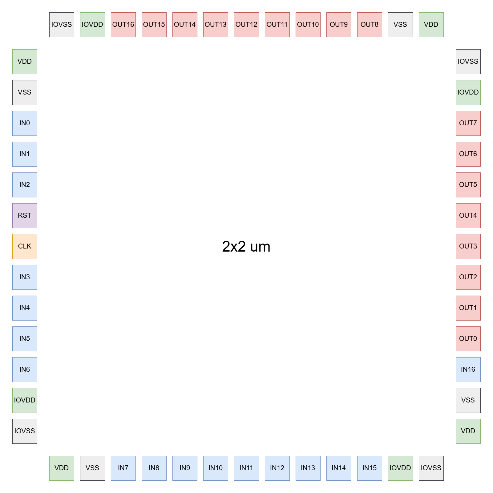</center>
<p align="center"><em>Figure 17: Shuttle GPIO assignment</em></p>

### Layout Integration

<center>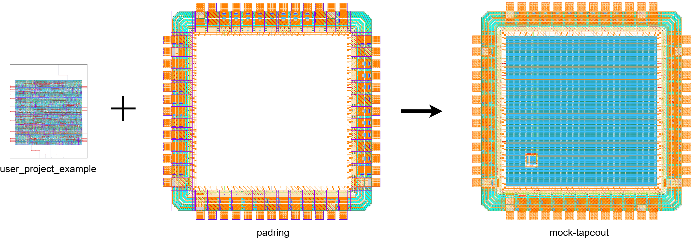</center>
<p align="center"><em>Figure 18: Integration of user projects into the shuttle</em></p>

### This Design on the Shuttle

<center></center>
<p align="center"><em>Figure 19: The PLL integrated into the UNIC-CASS chip</em></p>

The wrapper mandates a fixed 17-in / 17-out pad interface. That budget is why this PLL
loads its division ratio over a 3-wire serial interface rather than nine parallel pins.

> A 2.4 GHz output through a general-purpose digital pad is the weak point of this
> arrangement — pad and bond-wire parasitics dominate at that frequency. Plan the bench
> measurement accordingly: a divided-down output, or on-wafer probing.

Integration data is in [`UNIC-CASS-2025/`](UNIC-CASS-2025/); the wrapper flow is
documented in [`docs/README.md`](docs/README.md).

[Return to top](#toc)

---

<a name="repo"></a>
## 11. Repository Structure

| Path | Contents |
|------|----------|
| [`xschem/`](xschem/) | Schematics and symbols, grouped by block |
| [`spice/`](spice/) | Netlists exported from Xschem — the golden netlists LVS compares against |
| [`simulations/`](simulations/) | Testbench netlists and simulation decks |
| [`gds/`](gds/) | Layouts — `LC_VCO_FPLL.gds` (top) and `blocks/` |
| [`drc/`](drc/), [`lvs/`](lvs/), [`pex/`](pex/) | Archived verification runs, one directory per cell |
| [`em/`](em/) | **Open-source inductor EM flow: GDS → OpenEMS → SPICE** |
| [`model/`](model/) | Analytical sizing notebooks, gm/I<sub>D</sub> lookup tables, Qucs-S models |
| [`docs/`](docs/) | Documentation and images |
| [`archive/hfss/`](archive/hfss/) | Archived Ansys HFSS inductor work, superseded by `em/` |
| `openems/` | Placeholder from the earlier EM effort — superseded by [`em/`](em/) |
| [`UNIC-CASS-2025/`](UNIC-CASS-2025/) | Mock-tapeout wrapper integration data |
| [`paper_submission/`](paper_submission/) | Manuscripts and figure sources |

Working in this repository with an AI coding agent? See [`CLAUDE.md`](CLAUDE.md) for the
conventions, environment setup and known issues.

> **Windows users:** clone with `git clone -c core.longpaths=true ...` — some archived
> paths approach the 260-character limit and checkout otherwise fails partway.

[Return to top](#toc)

---

<a name="paper"></a>
## 12. Publication

Accepted for presentation at the **International Conference on Synthesis, Modeling,
Analysis and Simulation Methods, and Applications to Circuit Design (SMACD) 2026**.

> M. Thiriloganathan, S. Ranasinghe, A. Herath, R. Rameshkumar, H. Marasinghe,
> A. Viduranga, G. Leelarathne and K. Wickremasinghe,
> "**A 2.4 GHz LC-VCO Fractional-N Phase Locked Loop Open-Source Design in 130-nm
> BiCMOS**," *SMACD*, 2026.

<center></center>
<p align="center"><em>Figure 20: SMACD 2026 paper</em></p>

Manuscripts and figure sources are in [`paper_submission/`](paper_submission/).

### In the news

<center></center>
<p align="center"><em>Figure 21: Coverage by the Department of Electronic and Telecommunication Engineering, University of Moratuwa</em></p>

[Return to top](#toc)

---

<a name="ref"></a>
## 13. References

The following open-source PLL designs were referred to during development:

- Our past IHP openMPW submission (30 MHz Fractional-N PLL) — [TO_July2025](https://github.com/avishkaherath/TO_July2025/blob/main/30_MHz_Fractional_N_PLL/doc/source/designdata.rst)
- The 2025 IHP tapeout PLL — [cmos-pll-ihp-sg13g2](https://github.com/SkillSurf/cmos-pll-ihp-sg13g2)
- tt08-tiny-pll — [https://github.com/LegumeEmittingDiode/tt08-tiny-pll](https://github.com/LegumeEmittingDiode/tt08-tiny-pll)
- Razavi papers

Cited in the paper:

1. N. F. Assaify *et al.*, "A ring-oscillator-based 2.4 GHz integer-N PLL design in skywater 130nm open-source technology," in *ISPACS*, 2025.
2. B. Razavi, "Education of chip designers at a large scale: A proposal," *IEEE Solid-State Circuits Mag.*, 2024.
3. K. Herman *et al.*, "On the versatility of the IHP BiCMOS open source and manufacturable PDK," *IEEE Solid-State Circuits Mag.*, vol. 16, no. 2, pp. 30–38, 2024.
4. D. Liao *et al.*, "A 2.4-GHz 16-phase sub-sampling fractional-N PLL with robust soft loop switching," *IEEE J. Solid-State Circuits*, 2018.
5. G. Z. Gomez *et al.*, "Bluetooth low energy (BLE) radio design trends and considerations," *Electronics*, 2021.
6. B. Razavi, *RF Microelectronics*. Pearson, 2011.
7. S. S. Mohan *et al.*, "Simple accurate expressions for planar spiral inductances," *IEEE J. Solid-State Circuits*, 1999.
8. T. Liebig *et al.*, "openEMS — a free and open source equivalent-circuit (EC) FDTD simulation platform," *Int. J. Numer. Model.*, 2013.
9. F. Zhang *et al.*, "Design optimization and modeling of on-chip RF inductors in CMOS," in *IEEE MWSCAS*, 2009.
10. D. Ham and A. Hajimiri, "Concepts and methods in optimization of integrated LC VCOs," *IEEE J. Solid-State Circuits*, 2001.
11. J. Jo *et al.*, "Low phase-noise, 2.4 and 5.8 GHz dual-band frequency synthesizer with Class-C VCO and bias-controlled charge pump," *Electronics*, 2022.
12. J. S. Gaggatur *et al.*, "A digitally programmable 9.1–11.2 GHz CMOS LC-PLL with integrated power management for X-Band FMCW radar systems," in *IEEE SPACE*, 2025.
13. H. Shi *et al.*, "An ultra-wideband 125-MHz-to-8.4-GHz fractional-N PLL featuring an isolated multi-core VCO and an active-feedback doubler," *IEEE Microw. Wireless Technol. Lett.*, 2026.
14. J. Qiu *et al.*, "A 32-kHz-reference 2.4-GHz Fractional-N oversampling PLL with 200-kHz loop bandwidth," *IEEE J. Solid-State Circuits*, 2021.

[Return to top](#toc)
