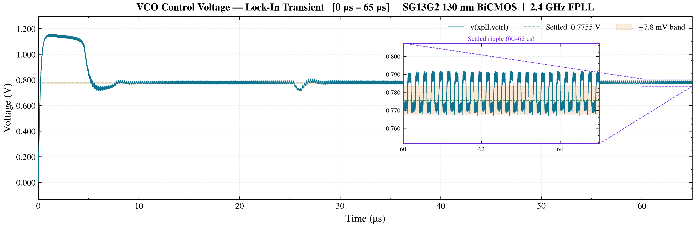
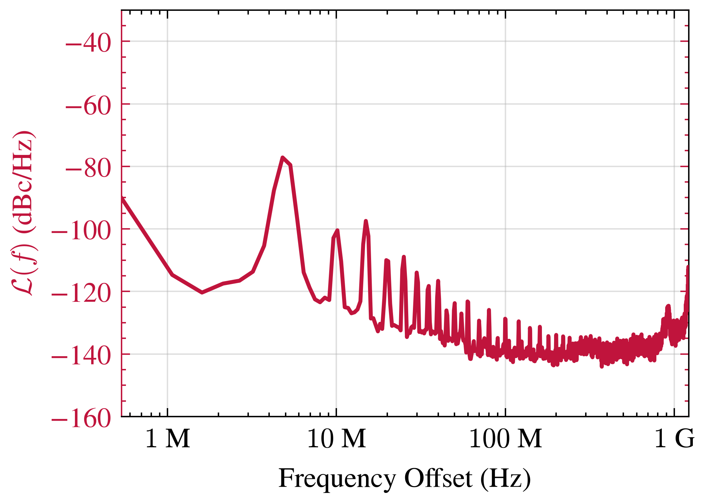
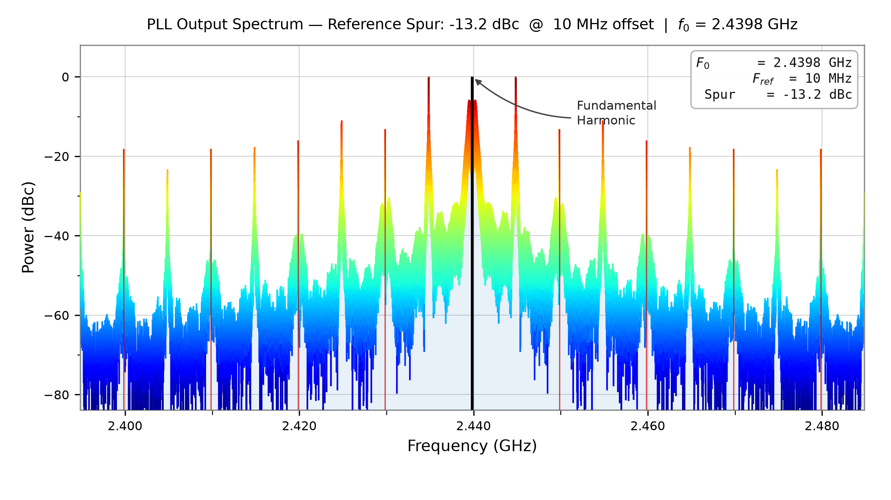

# Integrated PLL — pre-layout simulation (100 µs)

Full closed-loop transient of the schematic-level PLL (`LC_VCO_FPLL_tb.sch`), analysed with the
same scripts as the post-layout figures in [`../`](../).

| Setting | Value |
|---|---|
| Netlist | schematic, ideal wiring; ΔΣ divider is the behavioural model (`dsm_and_freq_divider.so`) |
| Supply / reference | VDD = 1.2 V, fREF = 10 MHz, N = 244 → 2.44 GHz |
| Run | `tran 10p 100u`, `reltol=1e-3`, gear; one continuous run, no restart |
| Raw file | `simulations/tb_LC_VCO_FPLL_100u.raw` (1.6 GB, not committed) |

## Results

| Quantity | Value | How it was measured |
|---|---|---|
| Locked output frequency | 2.4400 GHz | carrier in the phase-noise analysis, 58–73 µs |
| VCTRL, settled | 0.7785 V mean, 95 mV peak-to-peak ripple | mean over 60–100 µs |
| VCTRL, acquisition | overshoot to 1.155 V at 1.5 µs; first enters and stays in a ±2 % band (±15.5 mV) for at least 5 µs at 8.4 µs | 0–8.4 µs |
| VCTRL, disturbance | dip to 0.712 V at 25.9 µs, recovers within about 2 µs; the ±2 % band is left again at 78.9 µs | 24–30 µs, 78.9 µs |
| Supply current (VDD source) | 0.872 mA average | 60–100 µs |
| Phase noise @ 1 MHz | −114.7 dBc/Hz | 58–73 µs window, `plot_phase_noise.py` |
| Phase noise @ 10 MHz | −100.5 dBc/Hz | same |
| Reference spur @ 10 MHz | −13.2 dBc | 20–100 µs, `plot_reference_spur.py` |

## Caveats

- **Not comparable with the paper yet.** The phase-noise and spur values above differ from the
  post-layout figures in the main README (−100.8 dBc/Hz at 1 MHz, −40.2 dBc). The scripts use
  different analysis windows, and the spectrum here also has strong tones at ±5 MHz. The cause has
  not been established, so these numbers are not used in the main README.
- **Supply current is not the total power.** The divider is a behavioural model that draws no
  current, and the bandgap reference is an ideal source (`VBGR`), so 0.872 mA × 1.2 V ≈ 1.05 mW
  covers the charge pump, VCO and phase detector only.
- **No lock-time plot.** `plot_lock_time.py` reported "not achieved" for its ±200 ppm and ±10 ppm
  bands, and its time axis does not match the VCTRL transient, so its figure is not
  published. The lock time above is read from VCTRL.
- The 95 mV ripple means a ±7.75 mV band around the settled value is never held continuously;
  the ±2 % (±15.5 mV) band is the tightest that the ripple allows.
